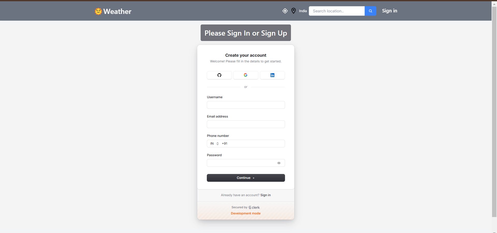
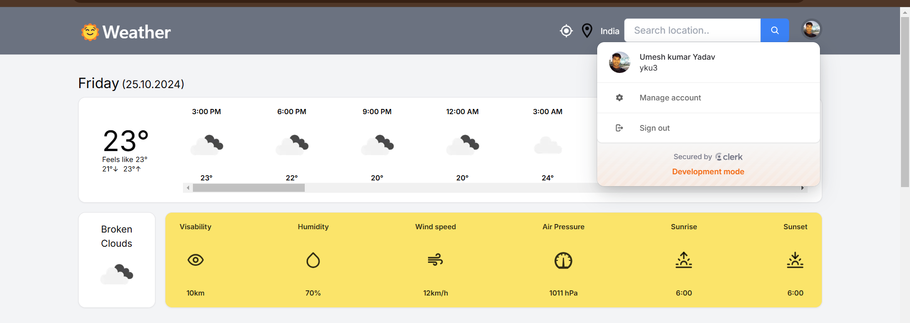

# Weather Monitoting_App

A weather application built using **TypeScript**, **React**, **ShadCN UI**, and the **OpenWeatherMap API**. This application allows users to search for weather information by city, displaying current conditions, temperature, and forecasts.


## Features

- **Search for Weather**: Enter a city name to get the current weather data.
- **Forecast Display**: View a 5-day weather forecast.
- **Responsive Design**: Fully responsive layout using ShadCN UI components.
- **Icons for UI**: Utilizes React Icons for enhanced UI elements.

## Tech Stack

- **TypeScript**: For static type checking.
- **React**: For building the user interface.
- **ShadCN UI**: A utility-first CSS framework for building responsive layouts.
- **OpenWeatherMap API**: To fetch weather data.
- **CSS**: For custom styles.
- **React Icons**: To include various icons in the UI.
- **Clerk** : User authentication 
### Prerequisites

- Node.js (version 14 or higher)
- npm (Node Package Manager)

## Screen Short







### Installation

1. Clone the repository:
   ```bash
   git clone https://github.com/yourusername/weather-app.git
   cd weather-app


## Getting Started

First, run the development server:

```bash
npm run dev
# or
yarn dev
# or
pnpm dev
# or
bun dev
```

Open [http://localhost:3000](http://localhost:3000) with your browser to see the result.

You can start editing the page by modifying `app/page.tsx`. The page auto-updates as you edit the file.

This project uses [`next/font`](https://nextjs.org/docs/basic-features/font-optimization) to automatically optimize and load Inter, a custom Google Font.


## Deploy on Vercel

The easiest way to deploy your Next.js app is to use the [Vercel Platform](https://vercel.com/new?utm_medium=default-template&filter=next.js&utm_source=create-next-app&utm_campaign=create-next-app-readme) from the creators of Next.js.

Check out our [Next.js deployment documentation](https://nextjs.org/docs/deployment) for more details.
